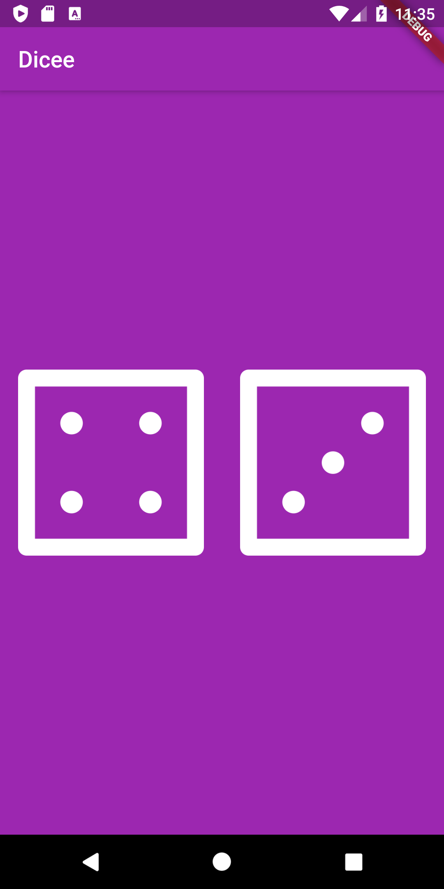

# Dicee 🎲

## 🤔 What is this App?!

We’re going to make a Las Vegas dice app. You can make the die roll at the press of a button. With this app in your pocket, you’ll be able to settle any score on the go!

## What I Learned 

- How to use Flutter stateless widgets to design the user interface.
- How to use Flutter stateful widgets to update the user interface.
- How to change the properties of various widgets.
- How to use onPressed listeners to detect when buttons are pressed.
- How to use setState to mark the widget tree as dirty and requiring update on the next render.
- How to use Expanded to make widgets adapt to screen dimensions.
- Understand and use string interpolation.
- Learn about basic dart programming concepts such as data types and functions.
- Code and use gesture controls.
## Screenshot

